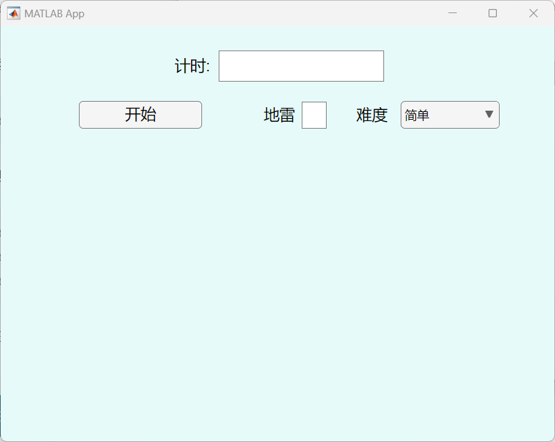

# 扫雷小程序

这是一个用 MATLAB 设计并打包的扫雷小程序，上传到此仓库是为了练习。

## 软件展示效果

## my_mine 使用说明

1. 选择好难度后，点击开始按钮即可进行游戏。
2. 鼠标左键是扫雷，右键设置小红旗标记，再次右键可取消标记。

## 难度

- 简单：10*10，地雷数：10
- 适中：10*10，地雷数：15
- 困难：15*15，地雷数：30
- 特困：20*20，地雷数：50

## 如何运行程序

- 如果电脑上有 MATLAB 环境，直接运行 `for_redistribution_files_only` 里的 `my_mine.exe` 文件即可运行程序。
- 如果没有 MATLAB 环境，首先需要安装 `for_redistribution` 里的 `MyAppInstaller_mcr.exe`（建议安装到全新的文件夹里，因为卸载该软件时会把文件夹清空），然后再进行上面步骤即可。

更多操作详情，请参考[这个链接](http://t.csdnimg.cn/pMfYU)。
